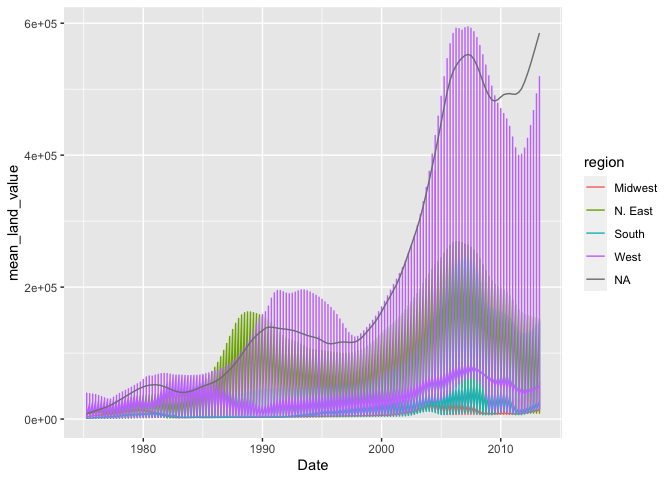
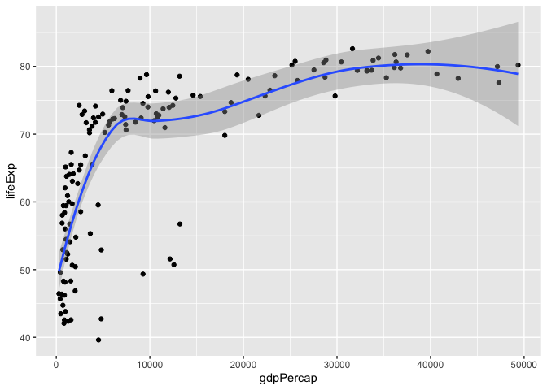
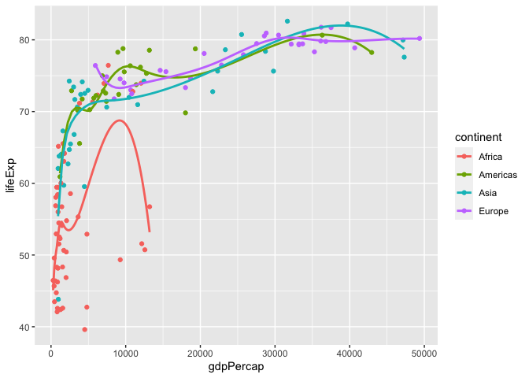
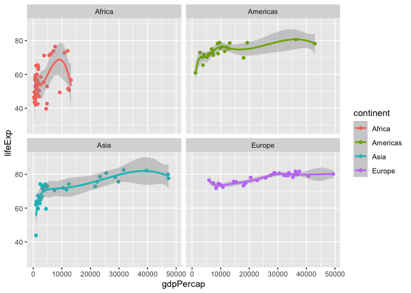
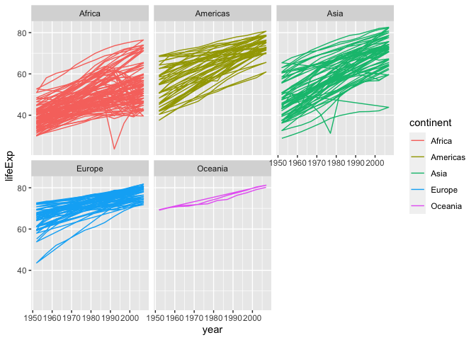
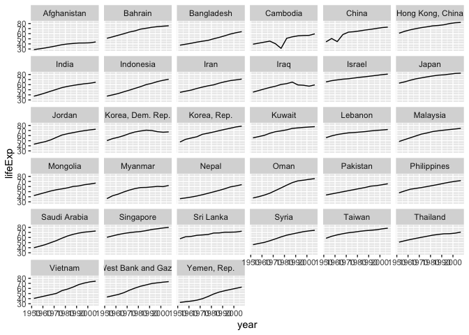

assignment_5
================
Wyatt
2023-03-02

``` r
library(tidyverse)
```

    ## ── Attaching packages ─────────────────────────────────────── tidyverse 1.3.2 ──
    ## ✔ ggplot2 3.4.0      ✔ purrr   1.0.1 
    ## ✔ tibble  3.1.8      ✔ dplyr   1.0.10
    ## ✔ tidyr   1.3.0      ✔ stringr 1.5.0 
    ## ✔ readr   2.1.3      ✔ forcats 1.0.0 
    ## ── Conflicts ────────────────────────────────────────── tidyverse_conflicts() ──
    ## ✖ dplyr::filter() masks stats::filter()
    ## ✖ dplyr::lag()    masks stats::lag()

``` r
library(knitr)
library(gapminder)
```

<br>

## Exercise 1. Trends in land value

This excercise uses a dataset that describes the trends in land value
(`Land.Value`), among other variables, in different states in the US
1975-2013. The states are grouped into four different regions, under the
variable `region`. This dataset was obtained from the Data Science
Services of Harvard University.

``` r
housing <- read_csv("https://raw.githubusercontent.com/nt246/NTRES-6100-data-science/master/datasets/landdata_states.csv")
```

    ## Rows: 7803 Columns: 11
    ## ── Column specification ────────────────────────────────────────────────────────
    ## Delimiter: ","
    ## chr (2): State, region
    ## dbl (9): Date, Home.Value, Structure.Cost, Land.Value, Land.Share..Pct., Hom...
    ## 
    ## ℹ Use `spec()` to retrieve the full column specification for this data.
    ## ℹ Specify the column types or set `show_col_types = FALSE` to quiet this message.

``` r
housing %>%
  head() %>% 
  kable() 
```

| State | region |    Date | Home.Value | Structure.Cost | Land.Value | Land.Share..Pct. | Home.Price.Index | Land.Price.Index | Year | Qrtr |
|:------|:-------|--------:|-----------:|---------------:|-----------:|-----------------:|-----------------:|-----------------:|-----:|-----:|
| AK    | West   | 2010.25 |     224952 |         160599 |      64352 |             28.6 |            1.481 |            1.552 | 2010 |    1 |
| AK    | West   | 2010.50 |     225511 |         160252 |      65259 |             28.9 |            1.484 |            1.576 | 2010 |    2 |
| AK    | West   | 2009.75 |     225820 |         163791 |      62029 |             27.5 |            1.486 |            1.494 | 2009 |    3 |
| AK    | West   | 2010.00 |     224994 |         161787 |      63207 |             28.1 |            1.481 |            1.524 | 2009 |    4 |
| AK    | West   | 2008.00 |     234590 |         155400 |      79190 |             33.8 |            1.544 |            1.885 | 2007 |    4 |
| AK    | West   | 2008.25 |     233714 |         157458 |      76256 |             32.6 |            1.538 |            1.817 | 2008 |    1 |

| State | region |    Date | Home.Value | Structure.Cost | Land.Value | Land.Share..Pct. | Home.Price.Index | Land.Price.Index | Year | Qrtr |
|:------|:-------|--------:|-----------:|---------------:|-----------:|-----------------:|-----------------:|-----------------:|-----:|-----:|
| AK    | West   | 2010.25 |     224952 |         160599 |      64352 |             28.6 |            1.481 |            1.552 | 2010 |    1 |
| AK    | West   | 2010.50 |     225511 |         160252 |      65259 |             28.9 |            1.484 |            1.576 | 2010 |    2 |
| AK    | West   | 2009.75 |     225820 |         163791 |      62029 |             27.5 |            1.486 |            1.494 | 2009 |    3 |
| AK    | West   | 2010.00 |     224994 |         161787 |      63207 |             28.1 |            1.481 |            1.524 | 2009 |    4 |
| AK    | West   | 2008.00 |     234590 |         155400 |      79190 |             33.8 |            1.544 |            1.885 | 2007 |    4 |
| AK    | West   | 2008.25 |     233714 |         157458 |      76256 |             32.6 |            1.538 |            1.817 | 2008 |    1 |

<br>

#### 1.1 Washington DC was not assigned to a region in this dataset. According to the United States Census Bureau, however, DC is part of the South region. Here:

- ###### Change the region of DC to “South” (Hint: there are multiple ways to do this, but `mutate()` and `ifelse()` might be helpful)

- ###### Create a new tibble or regular dataframe consisting of this new updated `region` variable along with the original variables `State`, `Date` and `Land.Value` (and no others)

- ###### Pull out the records from DC in this new data frame. How many records are there from DC? Show the first 6 lines.

| region | State | Land.Value |    Date |
|:-------|:------|-----------:|--------:|
| South  | DC    |     290522 | 2003.00 |
| South  | DC    |     305673 | 2003.25 |
| South  | DC    |     323078 | 2003.50 |
| South  | DC    |     342010 | 2003.75 |
| South  | DC    |     361999 | 2004.00 |
| South  | DC    |     382792 | 2004.25 |

<br>

``` r
housing %>% 
  replace(is.na(housing), "South") %>% 
  select(region, State, Land.Value, Date) %>% 
  filter(State == "DC") %>% 
  head()
```

    ## # A tibble: 6 × 4
    ##   region State Land.Value  Date
    ##   <chr>  <chr>      <dbl> <dbl>
    ## 1 South  DC        290522 2003 
    ## 2 South  DC        305673 2003.
    ## 3 South  DC        323078 2004.
    ## 4 South  DC        342010 2004.
    ## 5 South  DC        361999 2004 
    ## 6 South  DC        382792 2004.

<br>

#### 1.2 Generate a tibble/dataframe that summarizes the mean land value of each region at each time point and show its first 6 lines.

| region  |    Date | mean_land_value |
|:--------|--------:|----------------:|
| Midwest | 1975.25 |        2452.167 |
| Midwest | 1975.50 |        2498.917 |
| Midwest | 1975.75 |        2608.167 |
| Midwest | 1976.00 |        2780.000 |
| Midwest | 1976.25 |        2967.333 |
| Midwest | 1976.50 |        3212.833 |

``` r
housing %>% 
  mutate(Mean_land_value = mean(Land.Value)) %>% 
  filter(region == "Midwest") %>% 
  select(region, Date, Mean_land_value) %>% 
  head()
```

    ## # A tibble: 6 × 3
    ##   region   Date Mean_land_value
    ##   <chr>   <dbl>           <dbl>
    ## 1 Midwest 1975.          35779.
    ## 2 Midwest 1976.          35779.
    ## 3 Midwest 1976.          35779.
    ## 4 Midwest 1976           35779.
    ## 5 Midwest 1976.          35779.
    ## 6 Midwest 1976.          35779.

<br>

#### 1.3 Using the tibble/dataframe from 1.2, plot the trend in mean land value of each region through time.

``` r
housing %>% 
  mutate(mean_land_value = Land.Value) %>% 
    ggplot(mapping = aes(x = Date, y = mean_land_value )) + 
    geom_line(mapping = aes(color = region))
```

<!-- -->

<br>

## Exercise 2. Life expectancy and GDP per capita 1952-2007

This exercise uses the `gapminder` dataset from the `gapminder` package.
It describes the life expectancy (`lifeExp`), GDP per capita
(`gdpPercap`), and population (`pop`) of 142 countries from 1952 to
2007. These countries can be grouped into 5 continents. As a reminder,
**reproduce the following plots exactly as shown**.

``` r
gapminder %>% 
  head() %>% 
  kable()
```

| country     | continent | year | lifeExp |      pop | gdpPercap |
|:------------|:----------|-----:|--------:|---------:|----------:|
| Afghanistan | Asia      | 1952 |  28.801 |  8425333 |  779.4453 |
| Afghanistan | Asia      | 1957 |  30.332 |  9240934 |  820.8530 |
| Afghanistan | Asia      | 1962 |  31.997 | 10267083 |  853.1007 |
| Afghanistan | Asia      | 1967 |  34.020 | 11537966 |  836.1971 |
| Afghanistan | Asia      | 1972 |  36.088 | 13079460 |  739.9811 |
| Afghanistan | Asia      | 1977 |  38.438 | 14880372 |  786.1134 |

| country     | continent | year | lifeExp |      pop | gdpPercap |
|:------------|:----------|-----:|--------:|---------:|----------:|
| Afghanistan | Asia      | 1952 |  28.801 |  8425333 |  779.4453 |
| Afghanistan | Asia      | 1957 |  30.332 |  9240934 |  820.8530 |
| Afghanistan | Asia      | 1962 |  31.997 | 10267083 |  853.1007 |
| Afghanistan | Asia      | 1967 |  34.020 | 11537966 |  836.1971 |
| Afghanistan | Asia      | 1972 |  36.088 | 13079460 |  739.9811 |
| Afghanistan | Asia      | 1977 |  38.438 | 14880372 |  786.1134 |

<br>

\#### 2.1 Use a scatterplot to explore the relationship between per
capita GDP (`gdpPercap`) and life expectancy (`lifeExp`) in the year
2007.

``` r
gapminder %>% 
  filter(year == 2007) %>% 
  ggplot(mapping = aes(x = gdpPercap, y = lifeExp)) + 
  geom_point()
```

<!-- -->

<br>

#### 2.2 Add a smoothing line to the previous plot.

``` r
gapminder %>% 
  filter(year == 2007) %>% 
  ggplot(mapping = aes(x = gdpPercap, y = lifeExp)) + 
  geom_point()+
  geom_smooth()
```

    ## `geom_smooth()` using method = 'loess' and formula = 'y ~ x'

<!-- -->

<br>

#### 2.3 Exclude Oceania from the previous plot, show each continent in a different color, and fit a separate smoothing line to each continent to identify differences in this relationship between continents. Turn off the confidence intervals.

Note: only two Oceanian countries are included in this dataset, and
`geom_smooth()` does not work with two data points, which is why they
are excluded.

``` r
gapminder %>% 
  filter(year == 2007, continent != "Oceania") %>% 
  ggplot(mapping = aes(x = gdpPercap, y = lifeExp, color = continent)) + 
  geom_point(mapping = aes(x = gdpPercap, y = lifeExp, color = continent))+
  geom_smooth(method = lm, formula = y ~ splines::bs(x, 7), se = FALSE)
```

<!-- -->

<br>

#### 2.4 Use faceting to solve the same problem. Include the confidence intervals in this plot.

``` r
gapminder %>% 
  filter(year == 2007, continent != "Oceania") %>% 
  ggplot(mapping = aes(x = gdpPercap, y = lifeExp, color = continent)) + 
  geom_point(mapping = aes(x = gdpPercap, y = lifeExp, color = continent))+
  geom_smooth(method = lm, formula = y ~ splines::bs(x, 7), se = TRUE)+
  facet_wrap(~continent)
```

<!-- --> <br>

#### 2.5 Explore the trend in life expectancy through time in each continent. Color by continent.

``` r
gapminder %>% 
  ggplot(mapping = aes(x =year , y = lifeExp, color = continent)) + 
  geom_path()+
  facet_wrap(~continent)
```

<!-- -->

<br>

#### 2.6 From the previous plot, we see some abnormal trends in Asia and Africa, where the the life expectancy in some countries sharply dropped at certain time periods. Here, we look into what happened in Asia in more detail. First, create a new dataset by filtering only the Asian countries. Show the first 6 lines of this filtered dataset.

| country     | continent | year | lifeExp |      pop | gdpPercap |
|:------------|:----------|-----:|--------:|---------:|----------:|
| Afghanistan | Asia      | 1952 |  28.801 |  8425333 |  779.4453 |
| Afghanistan | Asia      | 1957 |  30.332 |  9240934 |  820.8530 |
| Afghanistan | Asia      | 1962 |  31.997 | 10267083 |  853.1007 |
| Afghanistan | Asia      | 1967 |  34.020 | 11537966 |  836.1971 |
| Afghanistan | Asia      | 1972 |  36.088 | 13079460 |  739.9811 |
| Afghanistan | Asia      | 1977 |  38.438 | 14880372 |  786.1134 |

``` r
gapminder %>% 
  filter(continent == "Asia") %>% 
  head()
```

    ## # A tibble: 6 × 6
    ##   country     continent  year lifeExp      pop gdpPercap
    ##   <fct>       <fct>     <int>   <dbl>    <int>     <dbl>
    ## 1 Afghanistan Asia       1952    28.8  8425333      779.
    ## 2 Afghanistan Asia       1957    30.3  9240934      821.
    ## 3 Afghanistan Asia       1962    32.0 10267083      853.
    ## 4 Afghanistan Asia       1967    34.0 11537966      836.
    ## 5 Afghanistan Asia       1972    36.1 13079460      740.
    ## 6 Afghanistan Asia       1977    38.4 14880372      786.

<br>

#### 2.7 Using the filtered dataset, identify the countries that had abnormal trends in life expectancy **by plotting**, and discuss historical events possibly explaining these trends. (Hint: facet by country)

``` r
gapminder %>% 
  filter(continent == "Asia") %>% 
  ggplot(mapping = aes(x=year, y=lifeExp)) +
  geom_line()+
  facet_wrap(~country)
```

<!-- -->

<br>
